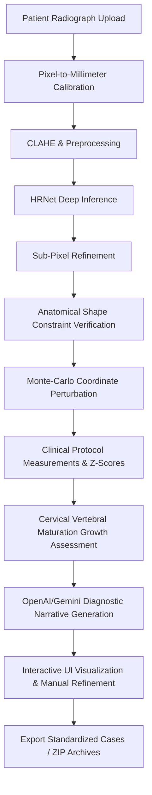

# 🦷 AI Cephalometric Analysis System

An end-to-end AI service for automated lateral cephalometric landmark detection, protocol-based geometric analysis, growth maturation prediction, and clinical overlay generation. The service exposes fine-grained FastAPI routes for the production backend.

---

## 🚀 Architectural Overview

This system is divided into two primary, high-performance services that collaborate through a standard REST API:

1. **High-Performance FastAPI Backend (`api/main.py`)**: Responsible for loading the deep learning models safely into memory, executing keypoint regression, checking anatomical shape constraints, executing sub-pixel snapping, performing Monte-Carlo simulations for geometric error margins, and interfacing with LLM providers for narrative synthesis.
2. **Interactive Streamlit Frontend (`app.py`)**: A modern, responsive clinical workstation enabling medical professionals to upload radiographs, execute manual 2-point pixel-to-millimeter calibration, visually adjust AI-predicted coordinates, view growth prediction vectors, read clinical interpretations, and export results into standardized digital clinical envelopes.

### Pipeline Flow



### Integration with DentalCare System
This AI service operates as the dedicated backend for the **DentalCare Clinic Management System**. The main ASP.NET Core MVC application (`DentalCare`) communicates with this FastAPI backend via `CephIntegrationService`. This integration allows doctors to seamlessly analyze patient radiographs, receive growth predictions, and maintain synchronized clinical records directly from the main clinic dashboard.

---

## ✨ Key Capabilities & Clinical Modules

### 1. Deep Landmark Localization Engine
* **High-Resolution Network (HRNet-W32)**: The core deep network architecture maintains high-resolution representations throughout the keypoint regression stages, reducing spatial quantization loss.
* **19-Landmark Core Set**: The current model is trained and deployed around the 19-point cephalometric landmark set used by the active measurement engines.
* **Robust Preprocessing**: Integrates Contrast-Limited Adaptive Histogram Equalization (CLAHE) to amplify bony structures and soft-tissue boundaries under low contrast.
* **Sub-Pixel Coordinate Snapping**: Uses local feature analysis after inference to refine landmark coordinates before measurement and diagnosis.

### 2. Clinical Measurement Protocols & Norms
The system computes clinical measurements for **10 active diagnostic protocols** with protocol-specific norms and landmark requirements:

| Protocol ID | Protocol Name | View | Focus & Measurements Included |
| :--- | :--- | :--- | :--- |
| `core_lateral` | **Core Lateral Screening** | Lateral | Core skeletal and vertical measurements (SNA, SNB, ANB, FMA, Facial Angle) |
| `steiner` | **Steiner Analysis** | Lateral | Steiner skeletal and vertical screening (adds SN-GoGn, IMPA, FMIA, Interincisal Angle) |
| `eastman_basic` | **Eastman Basic** | Lateral | Minimal Eastman-style sagittal screening |
| `eastman` | **Eastman Analysis** | Lateral | Eastman skeletal and vertical subset with current landmark support |
| `abo_american` | **ABO American Board Screening** | Lateral | ABO-recommended Steiner-style norms with range-based clinical targets |
| `tweed` | **Tweed Triangle** | Lateral | Frankfort-mandibular plane, incisor-mandibular plane, and derived FMIA |
| `downs` | **Downs Vertical Screening** | Lateral | Downs mandibular plane and interincisal configuration |
| `mcnamara` | **McNamara Screening** | Lateral | Lower anterior face height and nasolabial-angle subset |
| `jarabak` | **Jarabak Analysis** | Lateral | Jarabak growth assessment using face-height ratio and cranial base angles |
| `vertical_basic` | **Vertical Pattern Basic** | Lateral | Frankfort-mandibular and growth-axis screening subset |

---

## 📐 Mathematical Definitions of Cephalometric Measurements

The geometric core calculates angles and linear distances utilizing the following anatomical landmarks ($P_x$ references the internal database ID):

```text
Landmarks Used:
P1: Sella (S)            P2: Nasion (N)           P3: Porion (Po)          P4: Orbitale (Or)
P5: A-Point (Subspinale) P6: B-Point (Supramentale) P8: Menton (Me)          P9: Gnathion (Gn)
P10: Gonion (Go)         P11: Lower Incisor Apex  P12: Lower Incisor Edge  P13: Columella (Col)
P14: Subnasale (Sn)      P15: Labrale Superius    P18: ANS (Anterior Nasal Spine)
P19: Articulare (Ar)
```

### Skeletal Metrics
* **SNA Angle ($\theta_{\text{SNA}}$)**: Anteroposterior position of the maxilla relative to the anterior cranial base. Calculated as the angle between line segment $\overline{S-N}$ (P1 to P2) and segment $\overline{N-A}$ (P2 to P5):
$$\theta_{\text{SNA}} = \angle(S, N, A)$$
* **SNB Angle ($\theta_{\text{SNB}}$)**: Anteroposterior position of the mandible relative to the anterior cranial base. Calculated as the angle between line segment $\overline{S-N}$ (P1 to P2) and segment $\overline{N-B}$ (P2 to P6):
$$\theta_{\text{SNB}} = \angle(S, N, B)$$
* **ANB Angle ($\theta_{\text{ANB}}$)**: Sagittal relationship between the maxilla and mandible. Defines Skeletal Class I, II, or III:
$$\theta_{\text{ANB}} = \theta_{\text{SNA}} - \theta_{\text{SNB}}$$

### Vertical & Growth Metrics
* **FMA Angle (Frankfort-Mandibular Plane Angle)**: Vertical skeletal pattern representing mandibular rotation. Calculated as the angle of intersection between the Frankfort Horizontal plane $\overline{Po-Or}$ (P3 to P4) and the mandibular plane $\overline{Go-Me}$ (P10 to P8):
$$\theta_{\text{FMA}} = \text{IntersectionAngle}(\overline{Po-Or}, \overline{Go-Me})$$
* **SN-GoGn Angle**: Angle between the cranial base $\overline{S-N}$ and the mandibular base $\overline{Go-Gn}$ (P10 to P9):
$$\theta_{\text{SN-GoGn}} = \text{IntersectionAngle}(\overline{S-N}, \overline{Go-Gn})$$
* **Lower Anterior Facial Height (LAFH)**: The physical distance between the Anterior Nasal Spine (P18) and the Menton (P8), scaled by the pixel-to-millimeter factor:
$$\text{LAFH} = \text{Distance}(ANS, Me) \times \text{scale}_{\text{px\_to\_mm}}$$
* **Jarabak Face-Height Ratio**: The vertical facial proportion calculated as the ratio of Posterior Face Height (Sella-Gonion, $\overline{S-Go}$) to Anterior Face Height (Nasion-Menton, $\overline{N-Me}$):
$$\text{Jarabak Ratio} = \frac{\text{Distance}(S, Go)}{\text{Distance}(N, Me)}$$
* **Saddle Angle**: Angle between $\overline{N-S}$ and $\overline{S-Ar}$ ($\angle(N, S, Ar)$).
* **Articular Angle**: Angle between $\overline{S-Ar}$ and $\overline{Ar-Go}$ ($\angle(S, Ar, Go)$).
* **Gonial Angle**: Angle between $\overline{Ar-Go}$ and $\overline{Go-Me}$ ($\angle(Ar, Go, Me)$).

### Dental Metrics
* **IMPA (Incisor-Mandibular Plane Angle)**: Angle of the lower incisor relative to the mandibular base. Calculated as the intersection angle of the long axis of the lower incisor $\overline{Apex-Edge}$ (P11 to P12) and the mandibular plane $\overline{Go-Me}$ (P10 to P8):
$$\theta_{\text{IMPA}} = \text{IntersectionAngle}(\overline{\text{Apex-Edge}}, \overline{Go-Me})$$
* **FMIA (Frankfort-Mandibular Incisor Angle)**: Incisor angle relative to the Frankfort Horizontal:
$$\theta_{\text{FMIA}} = 180^{\circ} - \theta_{\text{FMA}} - \theta_{\text{IMPA}}$$
* **Interincisal Angle**: Angle between the long axes of the upper and lower central incisors.

---

## 🧠 Model Architecture & Deep Training Strategies

```text
+-------------------+      +-------------------+      +-------------------+      +-------------------+
|  Input Image      | ---> |   CLAHE Filter    | ---> |   HRNet-W32       | ---> |   Coordinate      |
|  (768x768 grayscale|     |  (Local Contrast) |      | (Parallel Subres) |      |   Offset Heatmaps |
+-------------------+      +-------------------+      +-------------------+      +-------------------+
```

### HRNet Representation Flow
Standard networks reduce image resolution repeatedly, causing loss of spatial detail. Our **HRNet-W32** backbone maintains high-resolution representations by keeping parallel multi-resolution subnetworks:
1. Starts with a high-resolution subnetwork.
2. Dynamically spawns new parallel subnetworks at lower resolutions.
3. Multi-scale fusion processes feedback streams between resolutions repeatedly, keeping feature channels geometrically aligned.

### Offset Heatmap Regression
Instead of mapping directly to raw pixel coordinates (which is highly non-linear and sensitive to noise), the network produces:
* **Keypoint Heatmaps**: A probability grid representing landmark centers using anisotropic Gaussian kernels to support spatial elongation.
* **Coordinate Offsets**: Sub-pixel fractional spatial offset matrices ($x, y$) pointing from the nearest grid intersection to the true anatomical point center, calculated via:
$$\mathcal{L}_{\text{total}} = \mathcal{L}_{\text{heatmap}} + \lambda \mathcal{L}_{\text{offset}}$$
Smooth L1 loss is used to regress offsets, and Online Hard Keypoint Mining (OHKM) prioritizes difficult keypoints (e.g., Orbitale, Porion) dynamically during training iterations.

---

## 📊 Monte-Carlo Measurement Uncertainty Engine

To account for digital radiograph noise and clinical keypoint variance, the system performs a Monte-Carlo simulation:
* **Perturbation Model**: Randomly perturbs coordinate positions over $N$ iterations (default $N=200$) using Gaussian distributions scaled by model confidence.
* **Anisotropic Scaling**: Simulates clinical reality by applying directional variance scaling (e.g., Menton exhibits higher vertical uncertainty due to symphysis curvature; Gonion exhibits higher horizontal uncertainty).
* **Robust Z-Scores**: Calculates the clinical deviation relative to healthy population norms using a combined standard deviation formula:
$$\sigma_{\text{combined}} = \sqrt{\sigma_{\text{measurement}}^2 + \sigma_{\text{norm}}^2}$$
* **Clinical Classification**: Automatically flags z-scores into `normal` ($Z \le 1.0$), `mild` ($1.0 < Z \le 2.0$), or `severe` ($Z > 2.0$) stages.

---

## 🦴 Cervical Vertebral Maturation (CVM) & Growth Stage Predictor

Using cervical vertebral boundaries (C2, C3, and C4 vertebral morphologies), the engine tracks the skeletal maturation stage (Stages 1–6) based on the Franchi-Baccetti classification:
* **Stage 1 (Pre-pubertal)**: Vertebral lower borders flat. High residual growth potential (36–60 months).
* **Stage 2 (Pubertal)**: Concavity begins to form on the lower border of C2.
* **Stage 3 (Pubertal peak)**: Concavity extends to C3 and C4. Optimal window for orthopedic/functional appliance therapy to guide mandibular growth.
* **Stage 4 (Post-pubertal)**: Rectangular vertebrae. Growth slowing down (6–12 months remaining).
* **Stage 5 (Maturation)**: Vertebrae become square. Minimal growth potential.
* **Stage 6 (Completion)**: Vertebrae taller than wide, lower borders straight. No residual growth.

It forecasts the **growth vector changes per year** for key metrics like ANB, FMA, SN-GoGn, and lower anterior height to guide treatment plans.

---

## 🗄️ Case Repository Database Schema

The FastAPI service does not store patients, cases, or analysis history in a local database. It receives request payloads, performs AI/measurement/diagnostic work, and returns results to the caller. Patient records and saved clinical reports are owned by the DentalCare ASP.NET application database.

### JSON Data Schemas Reference

#### 1. Landmark Input Schema
```json
[
  {
    "id": 1,
    "x": 145.60,
    "y": 212.40,
    "name": "Sella",
    "score": 0.985
  },
  {
    "id": 2,
    "x": 310.20,
    "y": 251.30,
    "name": "Nasion",
    "score": 0.978
  }
]
```

#### 2. Growth Assessment API Response (`/growth-assessment`)
```json
{
  "assessment_summary": {
    "cvm_stage": 3,
    "stage_name": "Stage 3 - Pubertal peak",
    "assessment_confidence": 0.70,
    "age_sex": "12 y/o female"
  },
  "growth_potential": {
    "classification": "moderate",
    "remaining_months": [12, 24],
    "is_actively_growing": true
  },
  "treatment_timing": {
    "recommendation": "OPTIMAL NOW: Active growth peak. Guide skeletal growth.",
    "optimality_score": 0.95,
    "total_duration_months": 25
  }
}
```

---

## 📂 Project Structure

```text
ai_service/
├── api/                    # FastAPI High-Performance Backend
│   ├── main.py             # Server endpoints & startup initialization
│   ├── model.py            # HRNet loading, preprocessing, and inference wrappers
│   ├── analysis.py         # 15+ geometric, skeletal, and vertical measurements
│   ├── measurements.py      # Monte-Carlo perturbation & z-score engine
│   ├── growth_stage.py     # CVM growth maturation & optimal treatment timing
│   ├── treatment_engine.py # Orthodontic treatment planning logic
│   ├── diagnostic_engine.py# Mathematical and diagnostic classification engine
│   ├── ai_engine.py        # OpenAI/Gemini clinician/patient narrative generators
│   ├── calibration.py      # Manual 2-point pixel-to-millimeter calibration
│   ├── calibration_auto.py # Auto-scale calibration via lead boundary ruler ticks
│   ├── protocols.py        # Clinical analysis configurations (Steiner, Tweed, Downs)
│   ├── norms.py            # Population reference parameters & clinical targets
│   └── reporting.py        # PDF, CSV, and WeDoCeph-compatible ZIP exporters
├── ui/                     # Streamlit Frontend UI Module
│   ├── tabs/               # Interactive clinical tabs (Intake, Calibration, Analysis)
│   ├── utils/              # API client connectors, geometric visualizers
│   ├── sidebar.py          # Case selections, provider settings, parameter controls
│   ├── constants.py        # Landmark labels, group indices, ethnic norm boundaries
│   ├── landmarks.py        # Canvas visualizers, active cross-hair display elements
│   ├── components.py       # Reusable layout metrics, charts, and table frames
│   └── viewer_utils.py     # HTML5 Canvas manual dragging and sub-pixel snapping
├── tools/                  # Developer CLI Utilities
│   ├── run_pipeline.py     # Quick offline test runner for model verification
│   └── predict_sample.py   # Batch run utility for diagnostic predictions
├── data/                   # Sample folders only; no AI-service database
├── dataset/                # Data loaders, augmentation, and preprocessing scripts
├── models/                 # Deep learning PyTorch weights (.pth)
├── training/               # Multi-GPU training loops and learning rate schedules
├── references/             # Anatomical norms references and sample case assets
├── tests/                  # Highly robust pytest test suite (44+ unit tests)
├── app.py                  # Main Streamlit user interface entry point
├── main.py                 # FastAPI dev server boot wrapper with hot-reload
├── requirements.txt        # Production dependency manifest
└── .env                    # Local secure configuration and API keys
```

---

## ⚙️ Installation & Configuration

### 1. Clone & Setup Virtual Environment
```bash
# Navigate to the ai_service directory within the DentalCare project
cd DentalCare/ai_service

# Initialize Python Virtual Environment
python -m venv venv
# Activate on Windows:
venv\Scripts\activate
# Activate on macOS/Linux:
source venv/bin/activate
```

### 2. Install Dependencies
```bash
pip install -r requirements.txt
```

### 3. Place Model Weights
Download the pre-trained weights for the landmark localization model and place them in the `models/` directory:
```text
models/best_model.pth
```

### 4. Setup Local Environment Parameters
Create a `.env` file at the root directory based on the `.env.example` template:
```bash
cp .env.example .env
```

Review and adjust the environment configurations to match your local setup:

| Variable | Default Value | Description |
| :--- | :--- | :--- |
| `MODEL_PATH` | `models/best_model.pth` | Absolute or relative path to PyTorch model weights |
| `INPUT_SIZE` | `768` | Image resizing dimensions used for model intake |
| `NUM_LANDMARKS` | `19` | Number of keypoints targets (19 or 29) |
| `CEPHALO_API_URL` | `http://localhost:8000` | Address of the FastAPI backend service |
| `CEPHALO_UI_URL` | `http://localhost:8501` | Address of the Streamlit frontend service |
| `OPENAI_API_KEY` | `your_openai_key` | API Key for GPT-based clinical reports generation |
| `OPENAI_MODEL` | `gpt-4o-mini` | Target OpenAI model family |
| `GEMINI_API_KEY` | `your_gemini_key` | API Key for Gemini-based diagnostic generation |
| `GEMINI_MODEL` | `gemini-1.5-pro` | Target Gemini model family |

---

## 🚀 Running the Services

### 1. Running the FastAPI Backend
Start the high-performance FastAPI server using our dev server wrapper, which dynamically reads your environment configuration, parses host information, and boots Uvicorn with hot-reloading:
```bash
py main.py
```
*Alternatively, run Uvicorn directly:*
```bash
uvicorn api.main:app --host 127.0.0.1 --port 8000 --reload
```
Once the backend boots, you can view the fully documented and interactive Swagger API playground at:
👉 **[http://127.0.0.1:8000/docs](http://127.0.0.1:8000/docs)**

### 2. Running the Streamlit Frontend
In a new terminal window, boot the clinical Streamlit app:
```bash
streamlit run app.py
```
This automatically boots a web browser pointing to:
👉 **[http://localhost:8501](http://localhost:8501)**

---

## 🧪 Comprehensive Developer API

Below is a reference guide for the core FastAPI endpoints exposed by the backend for programmatic integration:

| Method | Endpoint | Description | Key Request / Response Parameters |
| :---: | :--- | :--- | :--- |
| **GET** | `/health` | Checks that the FastAPI service is reachable. | No body. |
| **GET** | `/protocols` | Lists active cephalometric protocols. | No body. |
| **GET** | `/protocols/{protocol_id}` | Returns one protocol and a norms preview. | **Path**: protocol ID. |
| **POST** | `/protocols/{protocol_id}/validate` | Validates whether provided landmarks satisfy a protocol. | **JSON**: `landmarks`. |
| **POST** | `/calibrate` | Calculates px-to-mm scale from two selected points. | **JSON**: `point_a`, `point_b`, `real_distance_mm`. |
| **POST** | `/ai/detect-landmarks` | Performs HRNet landmark detection from a base64 image. | **JSON**: `session_id`, `image_base64`, `pixel_spacing_mm`. |
| **POST** | `/ai/calculate-measurements` | Computes protocol measurements from named landmarks. | **JSON**: `session_id`, `landmarks`, `pixel_spacing_mm`, `population`, `protocol_id`. |
| **POST** | `/ai/classify-diagnosis` | Classifies skeletal and vertical diagnosis from measurement values. | **JSON**: `session_id`, `measurements`, `protocol_id`. |
| **POST** | `/ai/suggest-treatment` | Generates treatment suggestions from diagnosis and measurements. | **JSON**: `session_id`, `skeletal_class`, `vertical_pattern`, `measurements`, `patient_age`. |
| **POST** | `/ai/explain-decision` | Returns explainable AI decision chain and key drivers. | **JSON**: diagnosis, probabilities, measurements, treatment, outcomes. |
| **POST** | `/ai/generate-overlays` | Generates tracing, measurement, and report overlay images. | **JSON**: `image_base64`, named landmarks, measurements, outputs. |
| **POST** | `/patient-letter` | Generates a warm, plain-language patient report from clinical findings. | **JSON**: `diagnostic_report`, `landmarks`, `provider`. |
| **POST** | `/auto-calibrate` | Automatically detects px_to_mm calibration using boundary metallic lead ruler markers on standard borders. | **Form-data**: `file`, `tick_interval_mm`. |
| **POST** | `/refine` | Snaps rough landmark placements to optimal pixel centers using local intensity/gradient refinement. | **Form-data**: `file`, `landmarks`, `method` ('intensity'/'edge'). |

### Programmatic Python Example
You can call the staged endpoints directly to perform measurements within scripts:
```python
import requests

API_BASE = "http://127.0.0.1:8000"

landmarks = {
    "Sella": {"x": 140.2, "y": 210.5},
    "Nasion": {"x": 305.8, "y": 250.1},
    "A Point": {"x": 320.1, "y": 380.4},
}

response = requests.post(
    f"{API_BASE}/ai/calculate-measurements",
    json={
        "session_id": "script-example",
        "landmarks": landmarks,
        "pixel_spacing_mm": 0.264,
        "population": "Caucasian",
        "protocol_id": "core_lateral",
    },
)
response.raise_for_status()
for row in response.json().get("measurements", []):
    print(row["measurement"], row["value"], row.get("status"))
```

---

## 🧪 Testing and Validation

A suite of automated tests should cover inference boundaries, geometric protocols, CVM mathematics, stateless API contracts, and LLM prompt consistency.

To run the automated tests:
```bash
pytest tests/
```

---

## 📝 Clinical Guidelines & Disclaimer

> [!WARNING]
> This software is intended as a clinical assistive tool to automate landmark positioning and geometric calculations. It is **not** a diagnostic device. All calculations, growth assessments, treatment timing configurations, and AI-generated narratives should be reviewed, edited, and approved by a qualified orthodontist or radiologist prior to clinical application or patient discussion.
